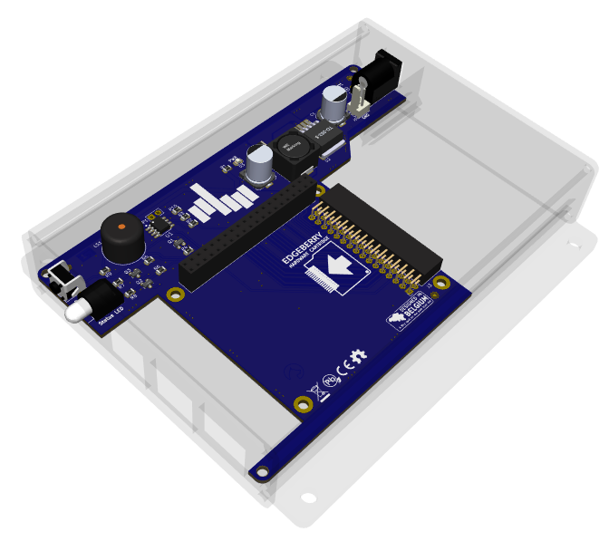

The **Edgeberry Base Board** project is a Raspberry Pi compatible 'HAT' providing several basics for easily using your Raspberry Pi as an IoT Edge device and deploying it in a real-world environment. Some key features are a powerful 3A step-down convertor for powering your device reliably using a regular 12V adaptor, indicators for providing status feedback, and an expansion slot for integrating application-specific hardware using an [Edgeberry Hardware Cartridge](https://github.com/SpuQ/Edgeberry-cartridge-console-can). The Edgeberry Hardware is designed to snugly fit in the [Edgeberry Enclosure](https://www.thingiverse.com/thing:6595172).
 
 

 

## Device Assembly
After acquiring the Edgeberry Base Board and Edgeberry enclosure, you're ready to assemble your device.

  
  
  

  
  
  

## Edgeberry Device Software
For using your Edgeberry hardware with the Edgeberry ecosystem (e.g. the Edgeberry Dashboard), you'll need to install the [Edgeberry Device Software](https://github.com/Edgeberry/Edgeberry/). Follow [these installation steps](https://github.com/Edgeberry/Edgeberry?tab=readme-ov-file#installation). If you have different plans with this board, this software is not required for correct operation of any of its hardware components.

## (re)Writing the EEPROM
>[!important]
>**When you purchased the Edgeberry Hardware, the manufacturer has written the EEPROM**. If you are the manufacturer, or you're hacking your Edgeberry board, then continue with the following steps.

1) Close the `write protection` jumper (JP1) on the Edgeberry Hardware to enable writing the EEPROM
2) Download and build the [Raspberry Pi Hat eeprom utils](https://github.com/raspberrypi/hats) on your device 
3) Make the EEPROM file from the eeprom_settings.txt using `eepmake`   e.g. `$ ./eepmake eeprom_settings.txt edgeberry.eep`
4) Flash the EEPROM using `eepflash.sh`   e.g. `$ sudo ./eepflash -w -t=24c256 -f=edgeberry.eep`
5) Now `reboot` the device and check the device tree for your hat's settings   e.g. `$ cat /proc/device-tree/hat/vendor`)

## License & Collaboration
**Copyright© 2024 Sanne 'SpuQ' Santens**. This project is released under the [**CERN OHL-W**](./LICENSE.txt) license. The [Rules & Guidelines](https://github.com/Edgeberry/.github/blob/main/brand/Edgeberry_Trademark_Rules_and_Guidelines.md) apply to the usage of the Edgeberry™ brand.

### Collaboration

If you'd like to contribute to this project, please follow these guidelines:
1. Fork the repository and create your branch from `main`.
2. Make your changes and ensure they adhere to the project's design style and conventions.
3. Test your changes thoroughly.
4. Ensure your commits are descriptive and well-documented.
5. Open a pull request, describing the changes you've made and the problem or feature they address.