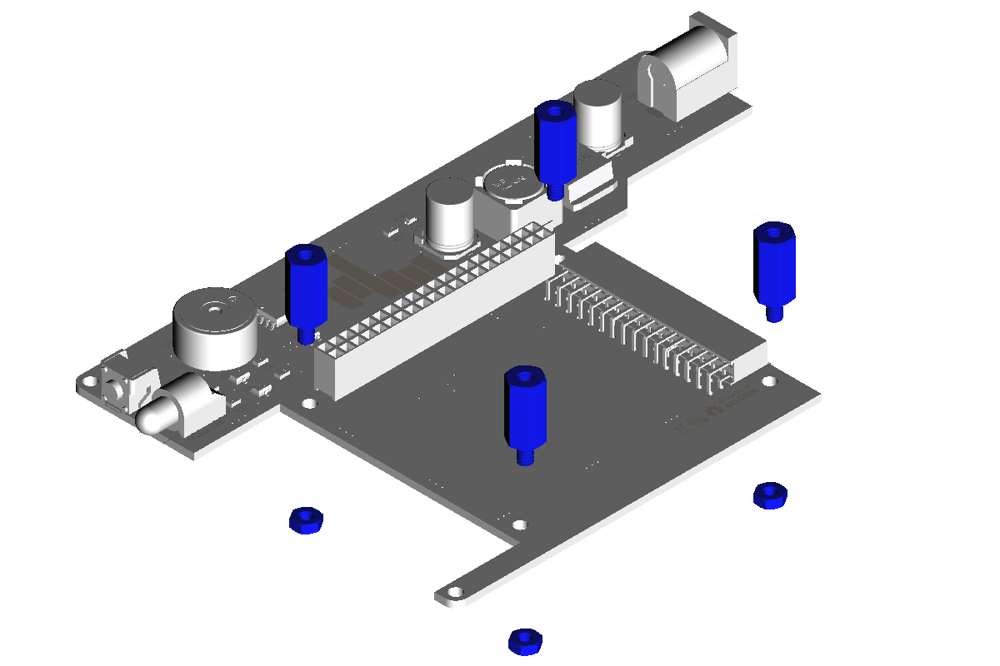
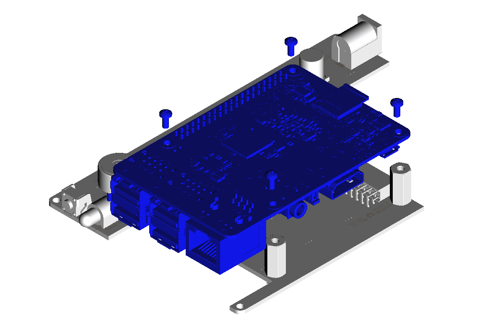
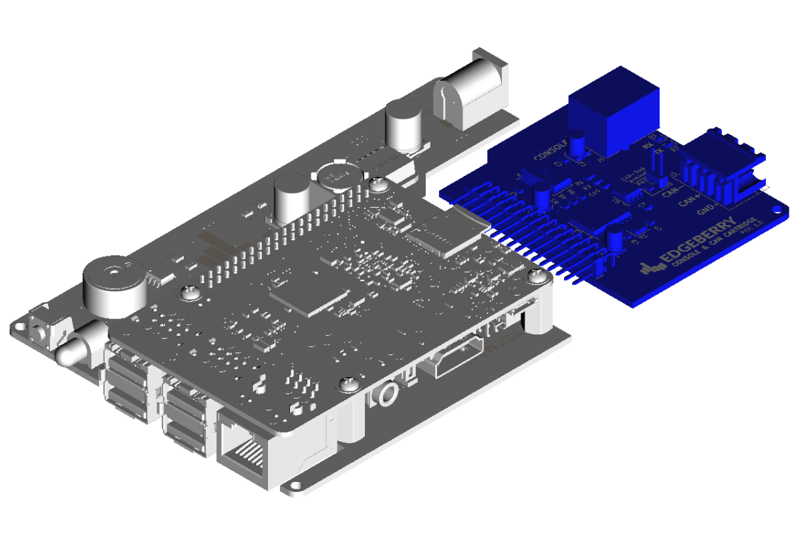
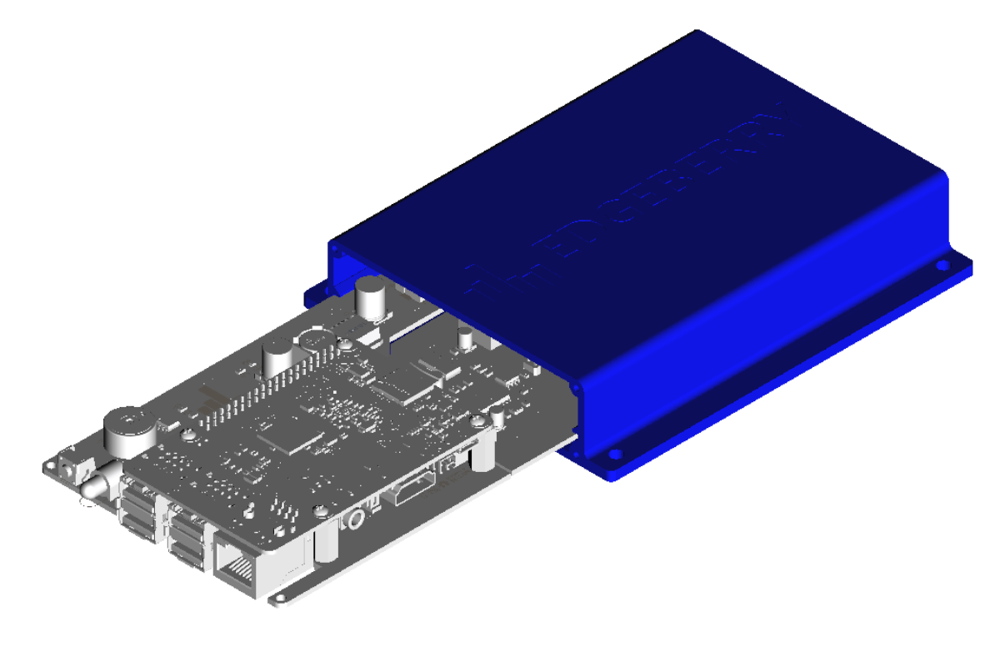
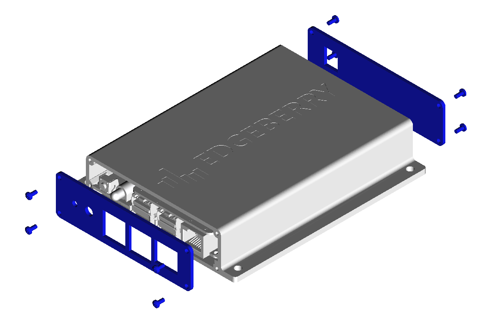
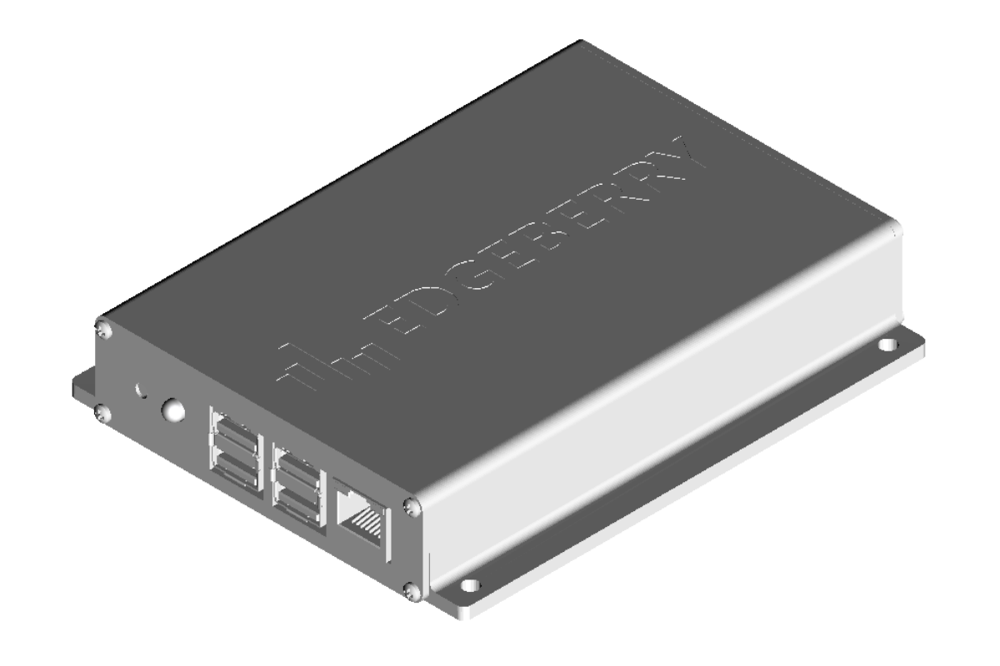

This is the Edgeberry Hardware project, a Raspberry Pi compatible 'hat' providing several basics for easily using your Raspberry Pi as an IoT Edge device and deploying it in a real-world environment.

<br clear="right"/>

## Device Assembly
After acquiring (or milling and soldering) the Edgeberry Hardware, and 3D printing the Edgeberry enclosure, you're ready to assemble your device.

<p float="left">
  
  
  
</p>
<p float="left">
</p>
<p float="left">
  
  
  
</p>

## Edgeberry Software
On your device, install the [Edgeberry application](https://github.com/SpuQ/EdgeBerry/) software by downloading and executing the installation script
```
wget -O install.sh https://github.com/SpuQ/EdgeBerry/releases/download/v2.3.3/install.sh
sudo ./install.sh
```
If everything was successful, you can now access your Edgeberry's web interface in your local network
```
http://<device_ip_address>:3000
```

## License & Collaboration
Copyright Sanne 'SpuQ' Santens. All rights reserved. For now - I'm looking into [open source hardware licenses](https://www.oshwa.org/).

### Collaboration

If you'd like to contribute to this project, please follow these guidelines:
1. Fork the repository and create your branch from `main`.
2. Make your changes and ensure they adhere to the project's coding style and conventions.
3. Test your changes thoroughly.
4. Ensure your commits are descriptive and well-documented.
5. Open a pull request, describing the changes you've made and the problem or feature they address.